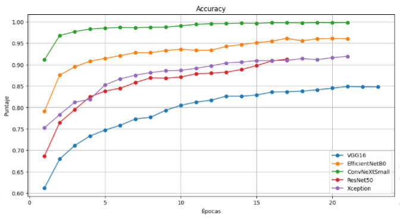
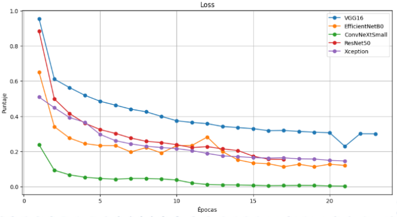
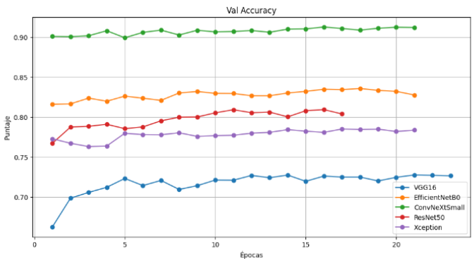

# Patch-Based Local Deraining for High-Resolution Images

## Abstract

This project focuses on the development of a method to process high-resolution images (HD, Full HD, 4K, and 8K) using neural networks dedicated to deraining. Its goal is to reduce or eliminate the distortions present in images captured under rainy conditions. Although there are currently numerous neural models—from convolutional neural networks (CNNs) and generative adversarial networks (GANs) to transformers—they all face challenges when working with very high-resolution images due to the substantial computational power required. While images can be downscaled to lower resolutions, doing so results in the loss of relevant information. Therefore, a method has been devised that consists of dividing the image into patches, processing each patch with the network to remove rain, and then recombining them to reconstruct the original image.

## Objetive

Develop a deep network for single-image deraining (SID) at high resolution, significantly improving visual quality while matching or surpassing state-of-the-art performance with-out relying on costly hardware.

## Rain Classification

Most convolutional neural networks dedicated to derainization adopt an autoencoder structure, composed of an encoder and a decoder. Therefore, it was essential to select a feature extractor (encoder) capable of detecting rainfall. To do so, established architectures (VGG16, ResNet50, ConvNeXtSmall, EfficientNetB0, and Xception) were evaluated to determine which one best detects rainfall disturbances. The training graphs of the selected networks, showing the Accuracy and Loss metrics, are shown in Fig. 1 and Fig. 2 below. All of them were trained on the same LHP-Rain dataset.

*Fig. 1.* Training accuracy graph.

*Fig. 2.* Training loss graph.

The LHP-Rain dataset is divided into training, testing, and validation folders, which enables the evaluation of accuracy and loss metrics during training. This allows measuring the network’s generalization capability on previously unseen data. These results are shown in Figures 3 and 4.

*Fig. 3.* Accuracy validation graph.

*Fig. 4.* Loss validation graph.

