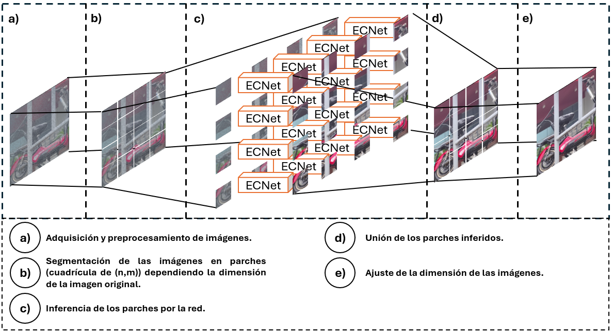
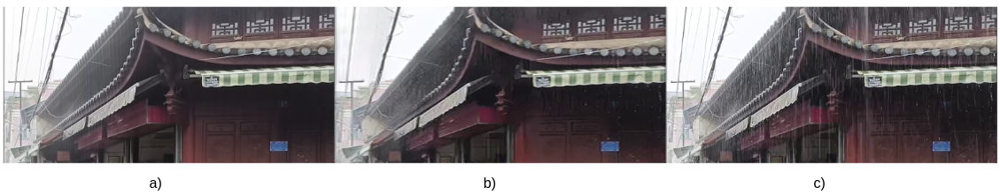
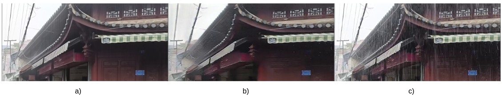

# Deep Learning Model for Image Deraining

## Abstract

This project focuses on developing a method for processing high-resolution images (Full HD, 2K, and 4K) using neural networks dedicated to deraining, without losing information through size reduction. Its goal is to reduce or eliminate distortions present in images captured under rainy conditions. While numerous neural network models exist—ranging from convolutional neural networks (CNNs) and generative adversarial networks (GANs) to transformers—they all present challenges when working with very high-resolution images due to the considerable computational power required. Although images can be reduced to lower resolutions, relevant information is lost in the process. Therefore, a method has been devised that involves dividing the image into patches, processing each patch with the network to remove the rain, and then recombining them to reconstruct the original image, creating a meta-architecture called NimbusNet.

## Problem

Rain marks degrade image quality and affect computer vision systems.
This project explores a deep learning approach to remove rain artifacts from high-resolution images using neural networks.

## Methodology
The methodology used in this project was as follows:
  1. Synthetic rain dataset generation
  2. Image preprocessing
  3. Patch extraction
  4. Neural network training
  5. Image reconstruction

## Network Architecture
The main quality of NimbusNet's architecture is to divide the work, as shown in the image.

  
   
  <em>NimbustNet Architecture.</em>

## Results 
The results from the data-DEGRAJAD and LHP-Rain databases are shown in Tables 1 and 2 respectively, showing the dimensions, computational consumption (MiB), PSNR and SSIM metrics in the Full-HD, 2K and 4K dimensions.

**Table 1: GPU memory consumption and quality metrics (PSNR and SSIM) for the networks evaluated in the Data-DEGRAJAD database..**

| Model           | Resolution | Scale   | GPU (MiB) | PSNR (dB) |  SSIM  |
|-----------------|-----------:|--------:|----------:|----------:|-------:|
| ECNetLL         | 512x512    | Full HD |    1796   |  29.0651  | 0.8514 |
| ECNetLL         | 1920x1080  | Full HD |    8790   |  32.1824  | 0.9151 |
| DRSformer       | 512x512    | Full HD |    6257   |  29.0483  | 0.8503 |
| DRSformer       | 1920x1080  | Full HD |    32079  |     -     |    -   |
| MPRNet          | 512x512    | Full HD |    2201   |  29.4964  | 0.8649 |
| MPRNet          | 1920x1080  | Full HD |    10224  |  32.0982  | 0.9121 |
| NimbusNet       | 1920x1080  | Full HD |    2170   |  31.9018  | 0.9116 |
| ECNetLL         | 512x512    |    2K   |    1796   |  28.9911  | 0.8423 |
| ECNetLL         | 2560x1440  |    2K   |    17600  |     -     |    -   |
| DRSformer       | 512x512    |    2K   |    6257   |  28.9745  | 0.8414 |
| DRSformer       | 2560x1440  |    2K   |    38270  |     -     |    -   | 
| MPRNet          | 512x512    |    2K   |    2115   |  29.4204  | 0.8544 |
| MPRNet          | 2560x1440  |    2K   |    11600  |     -     |    -   |
| NimbusNet       | 2560x1440  |    2K   |    1945   |  30.7609  | 0.8987 |
| ECNetLL         | 512x512    |    4K   |    1796   |  28.9820  | 0.8385 |
| ECNetLL         | 3840x2160  |    4K   |    20430  |     -     |    -   |
| DRSformer       | 512x512    |    4K   |    6257   |  28.9615  | 0.8378 |   
| DRSformer       | 3840x2160  |    4K   |    43200  |     -     |    -   |
| MPRNet          | 512x512    |    4K   |    2115   |  29.4111  | 0.8480 |
| MPRNet          | 3840x2160  |    4K   |    18800  |     -     |    -   |
| NimbusNet       | 3840x2160  |    4K   |    1744   |  26.3724  | 0.8218 |

**Table 2: GPU memory consumption and quality metrics (PSNR and SSIM) for the networks evaluated in the LHP-Rain database..**

| Model           | Resolution | Scale   | GPU (MiB) | PSNR (dB) |  SSIM  |
|-----------------|-----------:|--------:|----------:|----------:|-------:|
| ECNetLL         | 512x512    | Full HD |    1796   |  26.7057  | 0.8048 |
| ECNetLL         | 1920x1080  | Full HD |    8790   |  29.4949  | 0.8083 |
| DRSformer       | 512x512    | Full HD |    6257   |  25.2501  | 0.7431 |
| DRSformer       | 1920x1080  | Full HD |    32079  |     -     |    -   |
| MPRNet          | 512x512    | Full HD |    2201   |  30.5881  | 0.8786 |
| MPRNet          | 1920x1080  | Full HD |    10224  |  34.9273  | 0.8889 |
| NimbusNet       | 1920x1080  | Full HD |    2170   |  28.3045  | 0.7842 |
| ECNetLL         | 512x512    |    2K   |    1796   |  26.6503  | 0.8007 |
| ECNetLL         | 2560x1440  |    2K   |    17600  |     -     |    -   |
| DRSformer       | 512x512    |    2K   |    6257   |  25.2024  | 0.7467 |
| DRSformer       | 2560x1440  |    2K   |    38270  |     -     |    -   | 
| MPRNet          | 512x512    |    2K   |    2115   |  30.5031  | 0.8673 |
| MPRNet          | 2560x1440  |    2K   |    11600  |     -     |    -   |
| NimbusNet       | 2560x1440  |    2K   |    1945   |  27.8101  | 0.7728 |
| ECNetLL         | 512x512    |    4K   |    1796   |  26.6433  | 0.8042 |
| ECNetLL         | 3840x2160  |    4K   |    20430  |     -     |    -   |
| DRSformer       | 512x512    |    4K   |    6257   |  25.1964  | 0.7630 |   
| DRSformer       | 3840x2160  |    4K   |    43200  |     -     |    -   |
| MPRNet          | 512x512    |    4K   |    2115   |  30.4925  | 0.8591 |
| MPRNet          | 3840x2160  |    4K   |    18800  |     -     |    -   |
| NimbusNet       | 3840x2160  |    4K   |    1744   |  23.5738  | 0.6903 |

## Patch Deraining in ECNet

In this section, a visual comparison of the results obtained by the different neural networks will be presented, showing the original rainy image, the clean reference image, and the inferred image.

### DRSformer

  
   
  <em>Fig. 6. Inference using the DRSformer network. a) Clean image (no rain); b) Image inferred by the network;c) Rainy image.</em>

  
   
  <em>Fig. 7. Inference using the MPRNet network. a) Clean image (no rain); b) Image inferred by the network;c) Rainy image.</em>

  
   
  <em>Fig. 8. Inference using the ECNet network. a) Clean image (no rain); b) Image inferred by the network;c) Rainy image.</em>

  
   
  <em>Fig. 9. Inference using the proposed 9-patch method. a) Clean image (no rain); b) Image inferred by the network;c) Rainy image.</em>

  
   
  <em>Fig. 10. Inference using the proposed 16-patch method. a) Clean image (no rain); b) Image inferred by the network;c) Rainy image.</em>

  
   
  <em>Fig. 11. Inference using the proposed 40-patch method. a) Clean image (no rain); b) Image inferred by the network;c) Rainy image.</em>

